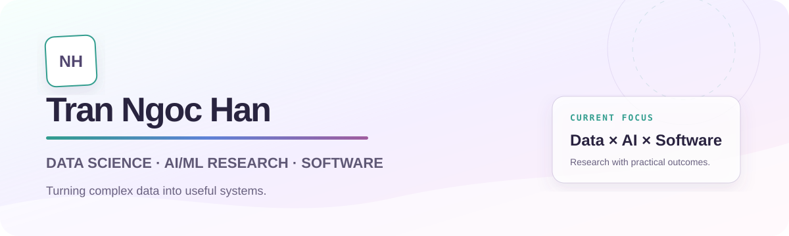
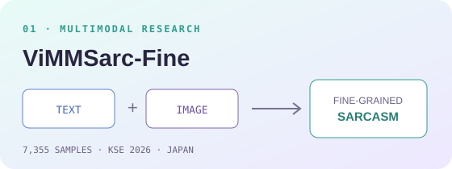
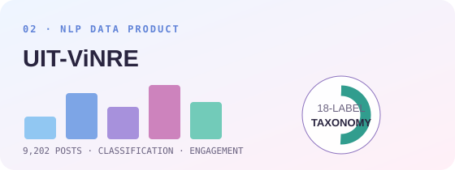
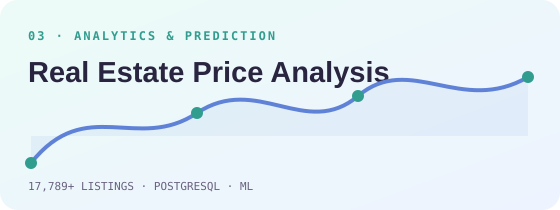
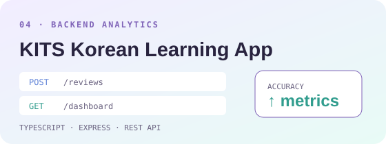

<p align="center">
  
</p>

<p align="center">
  <a href="https://ngochan1211.github.io/portfolio/"></a>
  <a href="assets/TranNgocHan_CV.pdf"></a>
  <a href="https://www.linkedin.com/in/han-tran-ngoc-158033366/"></a>
  <a href="mailto:ngochann051211@gmail.com"></a>
</p>

## Hello, I'm Han 👋

I am a **Data Science student at the University of Information Technology, VNU-HCM**, working across analytics, AI/ML research, dataset quality, and backend development. I enjoy turning complex data into evidence people can understand and systems they can use.

```text
CURRENT FOCUS
Data Analytics  ×  Applied AI  ×  Reliable Software
```

- 🔬 Research author of **ViMMSarc-Fine**, accepted at **KSE 2026, Japan**
- 📊 Experienced with Python, SQL, PostgreSQL, visualization, and machine learning
- 🧩 Built and validated Vietnamese social media datasets with structured annotation workflows
- ⚙️ Developing analytics services and agentic AI applications with TypeScript and Python
- 🌱 Currently learning **LangChain** and preparing for **AWS Certified Machine Learning Engineer — Associate**
- 💼 Open to internship and entry-level opportunities

## Selected work

<table>
  <tr>
    <td width="50%" valign="top">
      
      <h3>ViMMSarc-Fine</h3>
      <p>A 7,355-sample Vietnamese multimodal sarcasm dataset with fine-grained text, image, and multimodal labels. Research paper accepted at KSE 2026 in Japan.</p>
      <p><strong>Dataset Curation · Multimodal NLP · Annotation QA · Benchmarking</strong></p>
      <a href="https://github.com/nhatvu205/vi-multimodal-sacarsm-detection-on-social-media">Explore repository →</a>
    </td>
    <td width="50%" valign="top">
      
      <h3>UIT-ViNRE</h3>
      <p>A Vietnamese news and social media dataset containing 9,202 labeled Facebook posts, an 18-label taxonomy, a classification benchmark, and an engagement dashboard.</p>
      <p><strong>Python · Topic Classification · Data Quality · Dashboard</strong></p>
      <a href="https://github.com/NgocHan1211/UIT-ViNRE-Vietnamese-News-and-Social-Media-Dataset">Explore repository →</a>
    </td>
  </tr>
  <tr>
    <td width="50%" valign="top">
      
      <h3>Real Estate Price Analysis</h3>
      <p>Integrated 17,789+ property listings into PostgreSQL, developed a cleaning and feature engineering workflow, analyzed regional prices, and compared prediction models.</p>
      <p><strong>PostgreSQL · EDA · Feature Engineering · Regression</strong></p>
      <a href="https://github.com/pqtran28/Real-Estate-Price-Prediction">Explore repository →</a>
    </td>
    <td width="50%" valign="top">
      
      <h3>KITS Korean Learning App</h3>
      <p>Contributed to an analytics service with review scheduling, REST endpoints, request validation, persistent review state, and aggregate learning metrics.</p>
      <p><strong>TypeScript · Express · REST API · Jira Scrum</strong></p>
      <a href="https://github.com/TranQuyen-080405/KITSproject-Study_tool">Explore repository →</a>
    </td>
  </tr>
</table>

## Research spotlight

> **ViMMSarc-Fine: A Fine-Grained Vietnamese Multimodal Sarcasm Dataset**  
> Accepted at the International Conference on Knowledge and Systems Engineering, **KSE 2026 · Japan**.

The work covers dataset curation, a structured two-round annotation process, quality verification, exploratory analysis, and benchmark evaluation across textual, visual, and multimodal sarcasm.

## Technical toolkit

| Area | Tools and methods |
|---|---|
| **Data & Analytics** | Python, Pandas, NumPy, SQL, PostgreSQL, EDA, statistical testing, Power BI, Streamlit |
| **AI & Machine Learning** | Scikit-learn, XGBoost, classification, regression, model evaluation, SHAP, NLP, multimodal datasets |
| **Software Engineering** | TypeScript, Express, REST APIs, HTTP, Git/GitHub, Docker fundamentals, Linux CLI |
| **Quality & Collaboration** | Data validation, annotation QA, consistency checking, technical documentation, Jira, Trello |

## Education & credentials

- **Bachelor of Data Science**, University of Information Technology, VNU-HCM — expected 2027

<p align="center">
  
</p>

<p align="center">
  <a href="https://ngochan1211.github.io/portfolio/">Portfolio</a> ·
  <a href="https://github.com/NgocHan1211">GitHub</a> ·
  <a href="https://www.linkedin.com/in/han-tran-ngoc-158033366/">LinkedIn</a> ·
  <a href="mailto:ngochann051211@gmail.com">Email</a>
</p>

